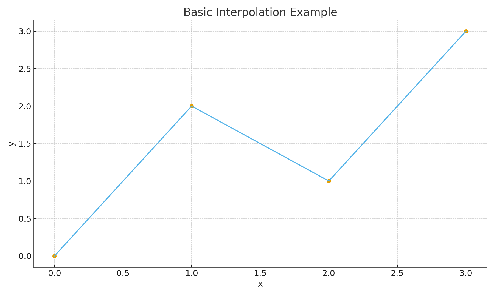
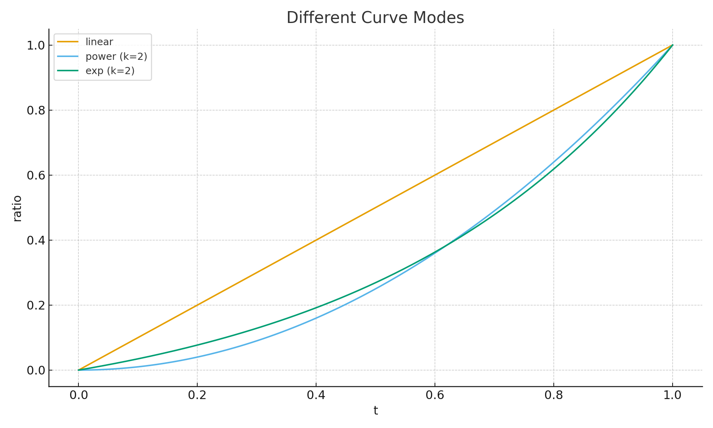
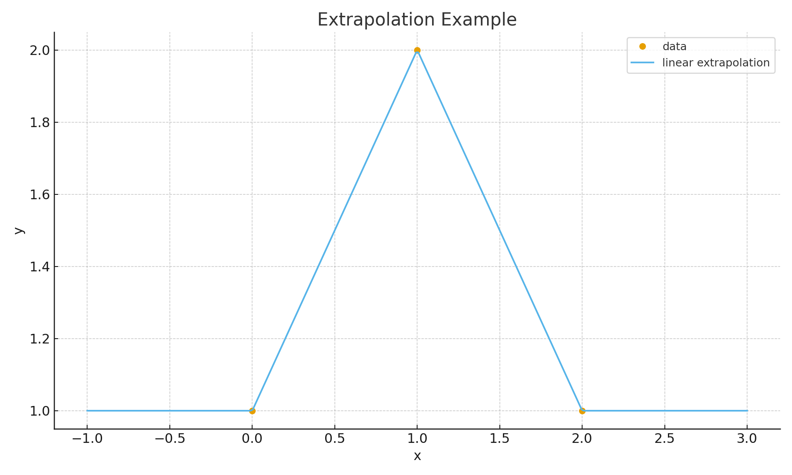

# safeinterp

Safe & intelligent 1D interpolation and extrapolation engine for Python.

> Adaptive curve selection, multi-segment fitting, and robust extrapolation – all with a clean, NumPy-friendly API.

<p align="center">
  <a href="https://github.com/mrbinxu2025-dotcom/safeinterp/stargazers">
    
  </a>
  <a href="https://github.com/mrbinxu2025-dotcom/safeinterp/actions">
    
  </a>
  <a href="https://pypi.org/project/safeinterp/">
    
  </a>
  <a href="https://github.com/mrbinxu2025-dotcom/safeinterp/blob/main/LICENSE">
    
  </a>
</p>

---

## 🚀 Features / 特性概览

- ✅ **Safe preprocessing / 安全预处理**
  - 自动排序 `x`，去除重复点与“两点过近”的奇异情况
  - 自动检查 NaN / Inf 并提供清晰的错误信息

- ✅ **Intelligent auto-mode / 智能插值 (`mode="auto"`)**
  - 自动从 `linear / power / exp / logistic / cos / sin / poly2 / poly3` 中择优
  - 自动对每一段计算最优 `(mode, k)`
  - 内置单调性约束，避免反冲 / 锯齿

- ✅ **Rich curve families / 多种曲线形状**
  - `linear`, `power`, `exp`, `logistic`, `sin`, `cos`, `poly2`, `poly3`

- ✅ **Safe extrapolation / 安全外推**
  - 支持 `edge / linear / exp / power / mirror / auto`
  - `auto` 模式会自动尝试多种策略，失败自动 fallback 到下一种
  - 最终保证**不会报错，不会崩溃，永远返回可用的结果**

- ✅ **Batch interpolation / 批量插值**
  - `batch_interp_curve` 支持多区域、多技术、多情景批量插值
  - 每个类别可独立设置 `x / y / new_x`、插值模式与外推方式
  - 也可继承公共 `common_x / common_new_x`

- ✅ **NumPy-only / 零额外依赖**
  - 不依赖 SciPy 或复杂库，可在任何轻量环境使用

---

## ❓ Why safeinterp? / 为什么要用 safeinterp？

大多数插值库在以下情况会失败或产生危险结果：

| 常见问题 | 常见库表现 | safeinterp |
|---------|-----------|------------|
| x 乱序 / 重复点 | ❌ 报错或结果不稳定 | ✔ 自动排序与去重 |
| 小间距 / 极短区间 | ❌ 斜率爆炸 | ✔ 自动修正，避免 NaN/Inf |
| 非单调 y | ❌ 曲线突然反转 | ✔ 内置趋势检测，减少反冲 |
| 幂律 / 指数外推 | ❌ 极易爆炸或报错 | ✔ 自动 fallback、保证安全 |
| 多段曲线选择 | ❌ 无智能模式 | ✔ 每段自动选取最佳形状 `(mode, k)` |

safeinterp 的目标是：

> **永不报错、永不崩溃、永不生成物理上不合理的曲线。**

---

## 📈 Basic Interpolation Example



## 🎨 Curve Modes



## 🛡 Extrapolation Example



---

## 🔧 Installation / 安装

### （推荐）PyPI 安装（发布后）

```bash
pip install safeinterp

当前源码安装
git clone https://github.com/mrbinxu2025-dotcom/safeinterp.git
cd safeinterp
pip install -e .

🚀 Quickstart / 快速上手
1. 简单插值
from safeinterp import interp_curve

x = [0, 10, 20, 30]
y = [0, 2, 8, 9]

interp_curve(x=x, y=y, new_x=[5, 15, 25])

2. Auto 模式
interp_curve(x, y, new_x, mode="auto")

3. 多段手动模式
segments = [
    {"mode": "linear"},
    {"mode": "power", "k": 1.5},
    {"mode": "cos"}
]

interp_curve(x, y, new_x, segments=segments)

4. 批量插值（多区域、多技术）
from safeinterp import batch_interp_curve

data = {
    "solar": {"y": [...], "mode": "auto"},
    "wind":  {"y": [...], "mode": "power", "k": 1.2},
}

batch_interp_curve(data, common_x=[2020,2030,2040], common_new_x=range(2020,2041))

🗺 Roadmap / 路线图

 2D surface interpolation

 Monotonic Hermite mode

 Smoothing spline mode

 Visualization helper API

 PyPI 发布

 在线 Demo (Colab)

🤝 Contributing / 参与贡献

PR、Issue、Feature Request 欢迎随时提出！

📄 License

MIT License
Copyright (c) 2025
